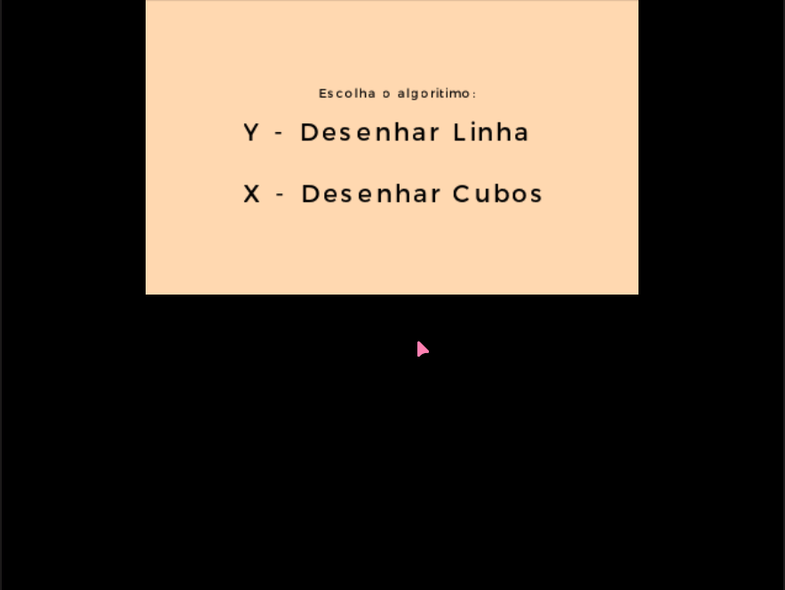

# RasterDraw-3ds
Implementation of rasterization algorithms using the 3ds GPU.

---

### About the project
This project started at my [CodeChallenges](https://github.com/CaioEmPessoa/CodeChallenges) repository as an school assignment, but since I presenteded it and people tought it was cool, I tought it made sense to split the repo into an independent one.

I'm not thaat proud of this code, since I had little time to do it (~2 days) in order to deliver the assingment, but the end result looks pretty cool, and works!!

## Running the project

If you're on linux you can run the 'make_run.sh' script. It have some options, in order to see them just run make_run.sh -h or help. You have to either have a physical 3ds or an emulator (I would recomend citra, since its the one I use.).

I have not tested it on another 3ds model other than the old one, but it should work too.

## Project showcase:
(If the video appears to be laggy, its probably because I recorded it as a GIF. Natively it runs very smoothly)

